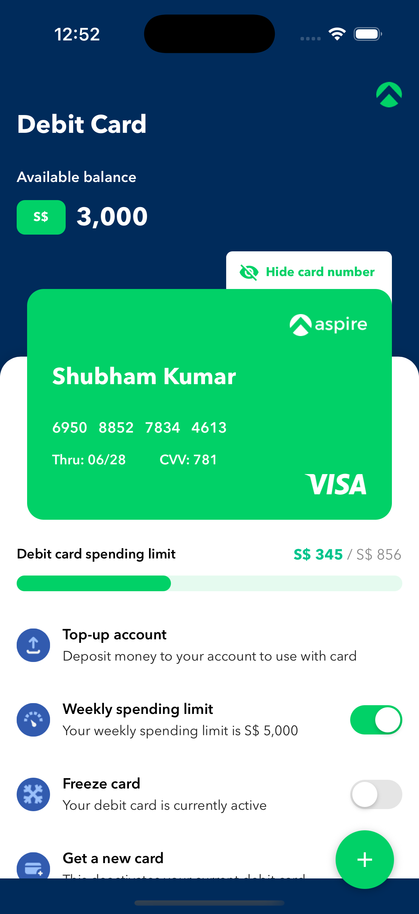
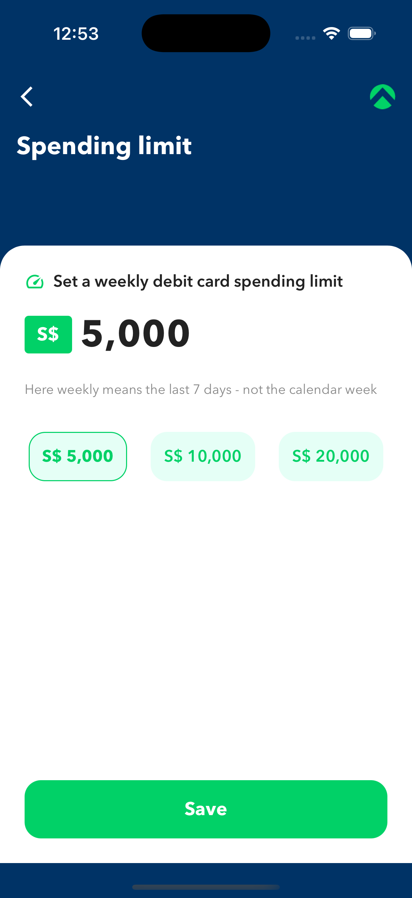
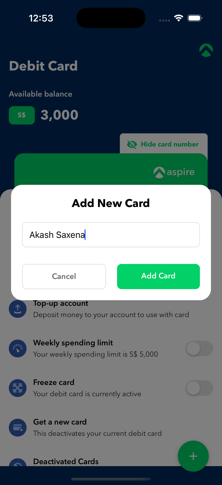

# Aspire Debit Card App

A React Native application for managing debit cards with features like card management, spending limits, and card freezing.

Android app:  
https://drive.google.com/drive/folders/1cVTp9W3M2_RgkrNYkWUveU5uB7WZE_0j?usp=sharing 

Ios app can be generated from repo. 

<div style="display: flex; justify-content: space-between; margin: 20px 0;">
  
  
  
</div>

## Features

### Card Management
- Add new debit cards
- Delete existing cards (with a minimum of one card required)
- View card details (number, expiry date, CVV)
- Show/hide card number for security
- Long press on card to delete

### Card Controls
- Freeze/unfreeze cards
- Set weekly spending limits
- View spending progress

## Prerequisites

- Node.js (v18 or higher)
- npm or yarn
- Xcode (for iOS development)
- Android Studio (for Android development)
- CocoaPods (for iOS dependencies)

## Installation

1. Clone the repository:
```bash
git clone https://github.com/shubhamptw/aspire-app.git
cd aspire-app
```

2. Install dependencies:
```bash
npm install
```

3. iOS specific setup:
```bash
cd ios
pod install
cd ..
```

## Running the App

### iOS

1. Open the iOS project in Xcode:
```bash
open ios/AspireApp.xcworkspace
```

2. Select your target device/simulator and run the app

OR

Run directly from terminal:
```bash
npm run ios
```

### Android

1. Start an Android emulator or connect a physical device

2. Run the app:
```bash
npm run android
```

## Usage Guide

### Managing Cards

#### Adding a New Card
1. Tap the "+" button (FAB) in the bottom right corner
2. Enter the cardholder's name in the modal
3. Tap "Add Card" to create a new card

#### Deleting a Card
1. Long press on the card you want to delete
2. Confirm deletion in the alert dialog
   - Note: You cannot delete the last remaining card

#### Viewing Card Details
- Card number is visible by default
- Tap the "Show/Hide card number" button to toggle visibility
- Card details include:
  - Card number
  - Expiry date
  - CVV
  - Cardholder name

### Card Controls

#### Freezing/Unfreezing Cards

1. Scroll down to the card options
2. Toggle the "Freeze card" switch
   - Green: Card is active
   - Gray: Card is frozen

#### Setting Spending Limits

1. In card options, toggle "Weekly spending limit"
2. Enter the desired limit amount
3. View spending progress in the card details

## Technical Details

### State Management
- Uses Redux for state management
- Redux Persist for local storage
- AsyncStorage for data persistence

### Mock API
The app uses local storage instead of a backend API:
- Card data is stored locally using AsyncStorage
- All operations (add, delete, update) are performed on the local state
- Data persists between app restarts

### Testing
Run tests using:
```bash
npm test
```

## Project Structure

```
src/
├── screens/
│   ├── DebitCardScreen/     # Main card management screen
│   └── SpendingLimitScreen/ # Spending limit configuration
├── store/                   # Redux store and slices
├── utils/                   # Utility functions
└── types/                   # TypeScript type definitions
```

## Dependencies

- React Native
- Redux & Redux Persist
- React Navigation
- React Native Vector Icons
- AsyncStorage

